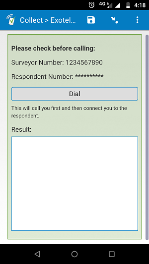
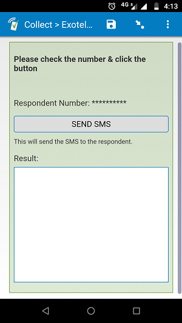
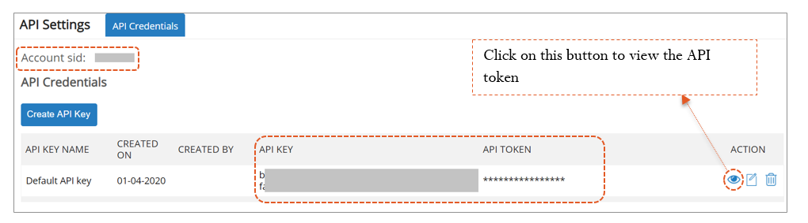

# Exotel Calls & SMS

## Description

This plug-in allows for Exotel calls to be made or SMSes to be sent from within a SurveyCTO form. 

[Exotel](https://exotel.com) is an ICT platform that allows for masking phone numbers on both ends of a phone call. This is helpful when enumerators have to use their own phones for calling respondents. Exotel  reroutes calls through fixed virtual numbers ensuring the privacy of both the enumerators and the respondents. 

## Features

 * Supports the `text` field type, but doesn't provide an actual text input. 
 * Allows you to choose if respondent number should be displayed to the enumerator on the plug-in page in the form.
 * Allows you to toggle Exotel's audio recording feature on or off.
 * This version of the plug-in only works with Indian phone numbers.
 * The Exotel server does not support Cross-Origin Resource Sharing (CORS). To overcome this problem, the plug-in routes API requests first to a J-PAL South Asia server and then to Exotel. 
	 * You are welcome to use the plug-in as-is (the J-PAL South Asia server can handle additional traffic) or you could create your own version of the plug-in to route requests to your own server. Exotel's API documentation can be accessed [here](https://developer.exotel.com/api).

## How to use

To use the plug-in as-is, download the [exotel-dialer.fieldplugin.zip](https://github.com/J-PAL-South-Asia/scto-exotel/raw/master/exotel-dialer.fieldplugin.zip) file from this repo, and attach it to your form. Make sure to provide the correct parameters (see below) when you design your form.

## Required parameters

The *appearance* specifications for calling and SMS are different. Please refer to both of these in the test form in [extras/test-form](https://github.com/J-PAL-South-Asia/scto-exotel/tree/master/extras/test-form). 

| Key | Value |
| --- | --- |
| `fromNumber` | This is the phone number of the caller. Value should either be pulled from a pre-loaded list or through an input field. Should be 10 digits and exclude the preceding '0' or '+91'.|
| `toNumber` | This is the phone number to be dialed. Should be 10 digits and exclude the preceding '0' or '+91'.|
| `apikey` | This is an API credential specific to your Exotel account (see below).|
|`apitoken`| Also an API credential to be copied from your Exotel Account.|
|`accountSid`|This is your Exotel account SID.|
|`calledID`|This is the ExoPhone number (Exotel virtual number) that you want to use for calling. If using a landline ExoPhone, leave the first 0 in the number.|
|`recording`| This specifies whether calls should be recorded or not. [=1] means yes, calls should be recorded and [=0] means no, calls should not be recorded. Specify recording=1 only if you have IRB approvals for recording calls.|
|`displaynumber`| This is a security parameter that lets you choose if the respondent number should be displayed to the enumerator or not. When [=0], the respondent number is **not** displayed on the screen. This is only useful when pulling phone numbers from a preloads .csv.|
|`msgBody`| Specify the SurveyCTO field name from where the SMS text needs to be pulled. You can preload the text into the form so that enumerators do not have to type it out.|
|`type="sms"`| This specifies that the plug-is being used for SMS. Use it exactly as specified here.|

### Exotel API and other credentials 
To access all Exotel API credentials, go to the ‘API’ page in the ‘Settings’ section. This is accessible to account administrators. The ExoPhone numbers can be found in the ‘ExoPhones’ page under the ‘Admin’ section on Exotel.

## More resources

* **Test form**  
 [extras/test-form](https://github.com/J-PAL-South-Asia/scto-exotel/tree/master/extras/test-form)
* **Developer documentation**  
Instructions and resources for developing your own field plug-ins.  
[https://github.com/surveycto/Field-plug-in-resources](https://github.com/surveycto/Field-plug-in-resources)
* **User documentation**  
How to get started using field plug-ins in your SurveyCTO form.  
[https://docs.surveycto.com/02-designing-forms/03-advanced-topics/06.using-field-plug-ins.html](https://docs.surveycto.com/02-designing-forms/03-advanced-topics/06.using-field-plug-ins.html)
